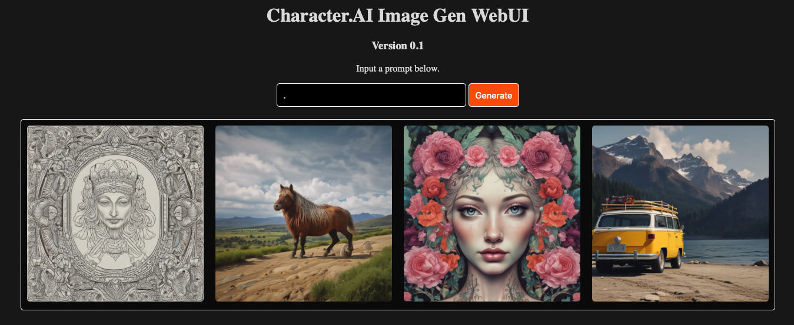
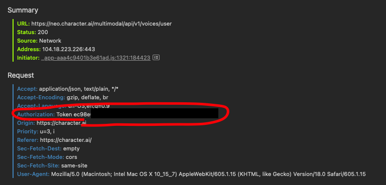

# CharacterAIImageGenUI
A simple web app running on pure Flask connecting to the Character.AI image generator.

## How to use

### How to obtain your token?

Look through request headers in developer tools on the Character.AI website until you find one with an `Authorization` token. It may be necessary to mess around on the website for a bit. Ensure you are signed in to your account during this. Here is an example of what you're looking for, using Safari:

Copy the string after `Token` and you're ready to go.

### The rest should be easy

Ensure Flask is installed and run the `main.py` file. Copy your token and you're ready to use the UI!
